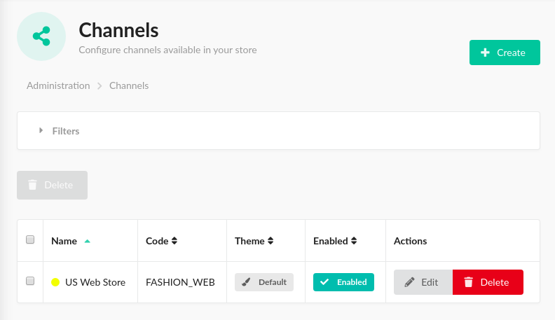
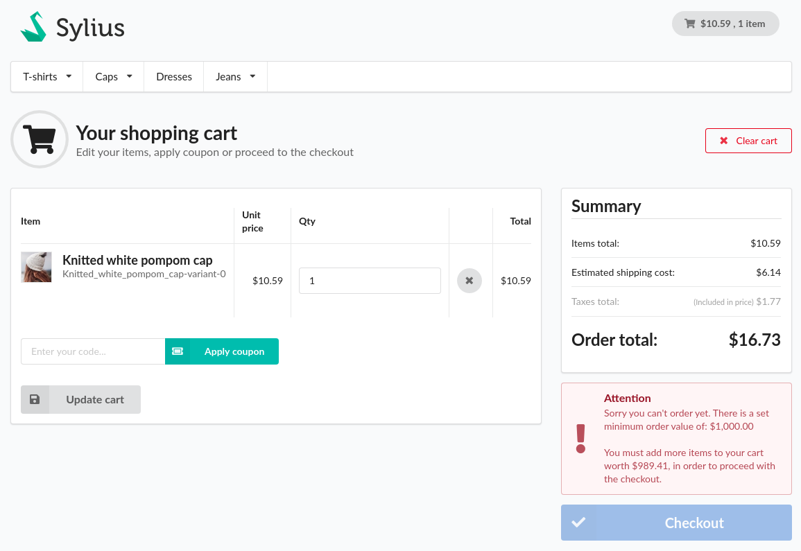
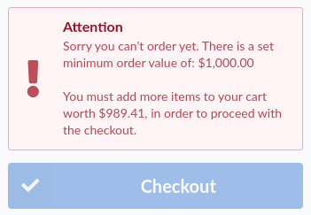
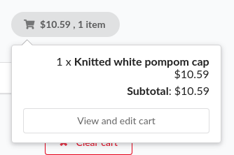

<div class="repo-badge inline-block vertical-align">
    <a id="status-image-popup" title="Latest push build on default branch: started" name="status-images" class="pointer open-popup">
        
    </a>
</div>
<br />
This plugin adds the option of configuring a minimum order value for each channel.

When a minimum order value is configured
it is not possible to checkout the order if the subtotal of all of the items in the cart is lower the configured minimum.

#### Configuration by administrator:
Configuring a minimum order value is possible by logging in as an administrator and navigating to the channel configuration:


Choose to edit an existing channel or to add a new one:



This plugin adds a segment to the add/edit pane that can be used to set the desired minimum order value in the base currency:


By default the toggle is set to the off position and the field to enter the minimum order value is disabled.
To configure the desired value use the toggle to enable the minimum order value and enter the value in the field.

#### What do visitors see?

When visiting the shop and not having added enough items to the shopping cart they will not be able to proceed to checkout:



The checkout button is disabled and a message is displayed, providing more insight in the current status:



When clicking the cart widget button, the checkout button is hidden:



If a visitor tries to skip ahead to the checkout process (for example by entering the url manually), the visitor
will automatically be redirected to the cart summary page.

#### How does it work?

Technically what this plugin does is a few things. It adds an optional field to the channel entity and the option to configure
the fields value through the admin system.

This value is used by the MinimumOrderValueReached class, which is configured as a guard on all of the transitions of the "sylius_order_checkout"
state machine.

By overriding the "sylius.resolver.checkout" service and disabling the original service, the plugin is able to redirect the
visitor to the cart summary page when the guard blocks the transition.

Overriding that service also means that the service needs to be configured slightly differently then before (only applicable if you have a customised checkout resolver configuration):

Whereas before the the checkout resolver could be configured through key "sylius_shop", it now needs to be done through key "nedac_sylius_minimum_order_value":
```yaml
nedac_sylius_minimum_order_value:
  checkout_resolver:
    pattern: /checkout/.+
    route_map:
      empty_order:
        route: sylius_shop_cart_summary
      cart:
        route: sylius_shop_checkout_address
      addressed:
        route: sylius_shop_checkout_select_shipping
      shipping_selected:
        route: sylius_shop_checkout_select_payment
      shipping_skipped:
        route: sylius_shop_checkout_select_payment
      payment_selected:
        route: sylius_shop_checkout_complete
      payment_skipped:
        route: sylius_shop_checkout_complete
```
This is the default configuration added by this plugin in `src/Resources/config/config.yaml`. It can be overridden on an 
application level as with any Symfony bundle configuration.

Please see the official Sylius docs on how to configure the checkout resolver, should there be any need to do so.

##### Supported Sylius versions:
<table>
    <tr><td>1.6</td></tr>
</table>


> **_NOTE:_** *This plugin requires PHP 7.4 or up*

#### Installation:
1. Install using composer:
    ```bash
    composer require nedac/sylius-minimum-order-value-plugin
    ```

2. Add to bundles.php:
    ```php
    # config/bundles.php
    <?php

    return [
        # ...
        Nedac\SyliusMinimumOrderValuePlugin\NedacSyliusMinimumOrderValuePlugin::class => ['all' => true],
    ];
    ```

3. Import configuration file:
    ```yaml
    # config/packages/_sylius.yaml
    imports:
       # ...

       - { resource: "@NedacSyliusMinimumOrderValuePlugin/Resources/config/config.yaml" }

    # ...
    ```

4. Implement the interface and use the trait in the Channel model:
    ```php
    # src/entity/Channel/Channel.php

    <?php

    declare(strict_types=1);

    namespace App\Entity\Channel;

    use Doctrine\ORM\Mapping as ORM;
    use Nedac\SyliusMinimumOrderValuePlugin\Model\ChannelInterface as NedacSyliusMinimumOrderValuePluginChannelInterface;
    use Nedac\SyliusMinimumOrderValuePlugin\Model\MinimumOrderValueTrait as
        NedacSyliusMinimumOrderValuePluginMinimumOrderValueTrait;
    use Sylius\Component\Core\Model\Channel as BaseChannel;

    /**
     * @ORM\Entity
     * @ORM\Table(name="sylius_channel")
     */
    class Channel extends BaseChannel implements NedacSyliusMinimumOrderValuePluginChannelInterface
    {
        use NedacSyliusMinimumOrderValuePluginMinimumOrderValueTrait;

        // ...
    }
    ```
    If the file `src/entity/Channel/Channel.php` does not yet exit, please create it using this example.
    When you do, also add the following section to `config/packages/_sylius.yaml`:
    ```yaml
    sylius_channel:
        resources:
            channel:
                classes:
                    model: App\Entity\Channel\Channel
    ```

5. Generate and run database migration:
    ```bash
    bin/console doctrine:migrations:diff
    bin/console doctrine:migrations:migrate
    ```

6. Override templates:
    ```twig
    {# templates/bundles/SyliusAdminBundle/Channel/_form.html.twig #}

    {{ form_errors(form) }}
    <div class="ui two column stackable grid">
        <div class="column">
            <div class="ui segment">
                {{ form_errors(form) }}
                <div class="two fields">
                    {{ form_row(form.code) }}
                    {{ form_row(form.name) }}
                </div>
                {{ form_row(form.description) }}
                {{ form_row(form.enabled) }}
                <div class="two fields">
                    <div class="field">
                        {{ form_label(form.hostname) }}
                        <div class="ui labeled input">
                            <div class="ui label">http://</div>
                            {{ form_widget(form.hostname) }}
                        </div>
                        {{ form_errors(form.hostname) }}
                    </div>
                    {{ form_row(form.contactEmail) }}
                </div>
                <div class="two fields">
                    {{ form_row(form.color) }}
                    {{ form_row(form.themeName) }}
                </div>
            </div>
            <div class="ui segment">
                <h4 class="ui dividing header">{{ form_label(form.shopBillingData) }}</h4>
                <div class="two fields">
                    {{ form_row(form.shopBillingData.company) }}
                    {{ form_row(form.shopBillingData.taxId) }}
                </div>
                <div class="two fields">
                    {{ form_row(form.shopBillingData.countryCode) }}
                    {{ form_row(form.shopBillingData.street) }}
                </div>
                <div class="two fields">
                    {{ form_row(form.shopBillingData.city) }}
                    {{ form_row(form.shopBillingData.postcode) }}
                </div>
            </div>
        </div>
        <div class="column">
            <div id="nedac-sylius-minimum-order-value-plugin-admin-before" class="ui segment">
                {{ form_row(form.locales) }}
                {{ form_row(form.defaultLocale) }}
                {{ form_row(form.currencies) }}
                {{ form_row(form.baseCurrency) }}
                {{ form_row(form.defaultTaxZone) }}
                {{ form_row(form.taxCalculationStrategy) }}
                {{ form_row(form.skippingShippingStepAllowed) }}
                {{ form_row(form.skippingPaymentStepAllowed) }}
                {{ form_row(form.accountVerificationRequired) }}
            </div>
            
                <div id="nedac-sylius-minimum-order-value-plugin-admin-segment" class="ui segment">
                    {{ form_row(form.minimumOrderValue) }}
                    <div class="ui toggle checkbox">
                        <input id="nedac-sylius-minimum-order-value-plugin-admin-toggle" type="checkbox" name="public">
                        <label>{{ 'nedac_sylius_minimum_order_value_plugin.ui.enabled'|trans }}</label>
                    </div>
                </div>
            
        </div>
    </div>
    ```
    ```twig
    {# templates/bundles/SyliusShopBundle/Cart/Summary/_checkout.html.twig #}

    
    
    
    
    
    
        
    
        
        
        
        <div class="ui icon negative message">
            <i class="warning icon"></i>
            <div class="content">
                <div class="header">{{ 'nedac_sylius_minimum_order_value_plugin.ui.attention'|trans }}</div>
                <p id="nedac-sylius-minimum-order-value-plugin-message">{{ 'nedac_sylius_minimum_order_value_plugin.ui.minimum_not_yet_reached'|trans({ '%minimumOrderValue% ': formattedMinimum, '%difference%': formattedDifference })|raw('br') }}</p>
            </div>
        </div>
    
    <a href="{{ path('sylius_shop_checkout_start') }}" class="{{ buttonClass }}" id="nedac-checkout-button"><i class="check icon"></i> {{ 'sylius.ui.checkout'|trans }}</a>
    ```
    ```twig
    {# templates/bundles/SyliusShopBundle/Cart/_widget.html.twig #}

    
    
    
    
    
    <div id="sylius-cart-button" class="ui circular cart button">
        {{ sonata_block_render_event('sylius.shop.partial.cart.summary.before_widget_content', {'cart': cart}) }}
    
        <i class="cart icon"></i>
        <span id="sylius-cart-total">
            {{ money.convertAndFormat(cart.itemsTotal) }}
        </span>
        sylius.ui.item.choice
    
        {{ sonata_block_render_event('sylius.shop.partial.cart.summary.after_widget_content', {'cart': cart}) }}
    </div>
    <div class="ui large flowing cart hidden popup" id="nedac-sylius-minimum-order-value-plugin-popup">
        {{ sonata_block_render_event('sylius.shop.partial.cart.summary.before_popup_content', {'cart': cart}) }}
    
        
            {{ 'sylius.ui.your_cart_is_empty'|trans }}.
        
            <div class="ui list">
                
                    <div class="item">{{ item.quantity }} x <strong>{{ item.product }}</strong> {{ money.convertAndFormat(item.unitPrice) }}</div>
                
                <div class="item"><strong>{{ 'sylius.ui.subtotal'|trans }}</strong>: {{ money.convertAndFormat(cart.itemsTotal) }}</div>
            </div>
            <a href="{{ path('sylius_shop_cart_summary') }}" class="ui fluid basic text button">{{ 'sylius.ui.view_and_edit_cart'|trans }}</a>
            
                <div class="ui divider"></div>
                <a href="{{ path('sylius_shop_checkout_start') }}" class="ui fluid primary button">{{ 'sylius.ui.checkout'|trans }}</a>
            
        
    
        {{ sonata_block_render_event('sylius.shop.partial.cart.summary.after_popup_content', {'cart': cart}) }}
    </div>
    ```
7. Install assets:
    ```bash
    bin/console sylius:install:assets
    ```
#### Setup development environment:
```bash
docker-compose build
docker-compose up -d
docker-compose exec php composer --working-dir=/srv/sylius install
docker-compose run --rm nodejs yarn --cwd=/srv/sylius/tests/Application install
docker-compose run --rm nodejs yarn --cwd=/srv/sylius/tests/Application build
docker-compose exec php bin/console assets:install public
docker-compose exec php bin/console doctrine:schema:create
docker-compose exec php bin/console sylius:fixtures:load -n
```
#### Running tests:
```bash
docker-compose exec php sh
bin/console doc:sche:cre
cd ../..
vendor/bin/phpcs
vendor/bin/phpstan analyse src/ --level max
vendor/bin/phpunit
vendor/bin/behat
```
